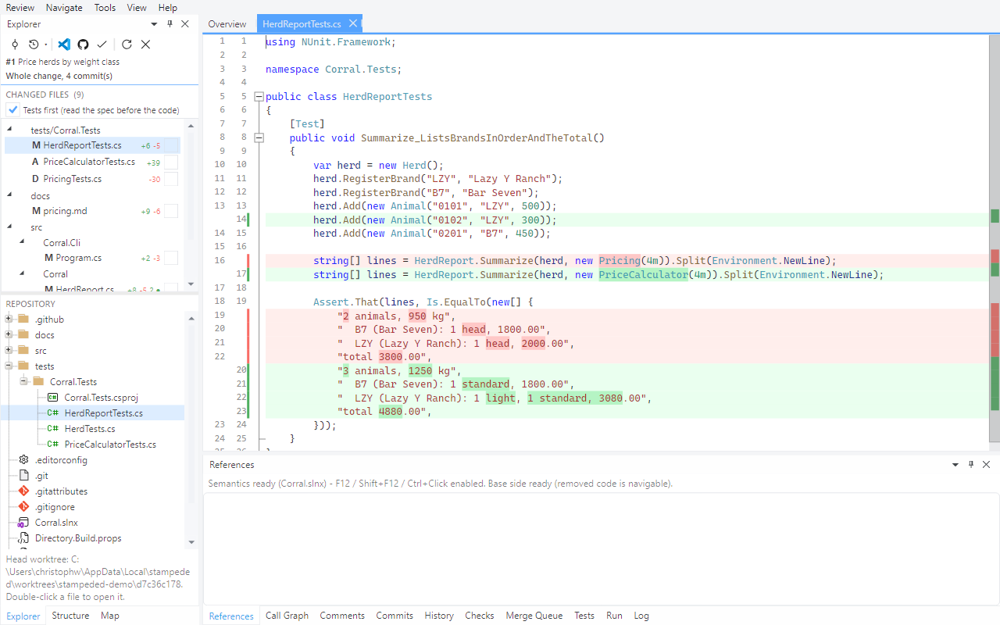
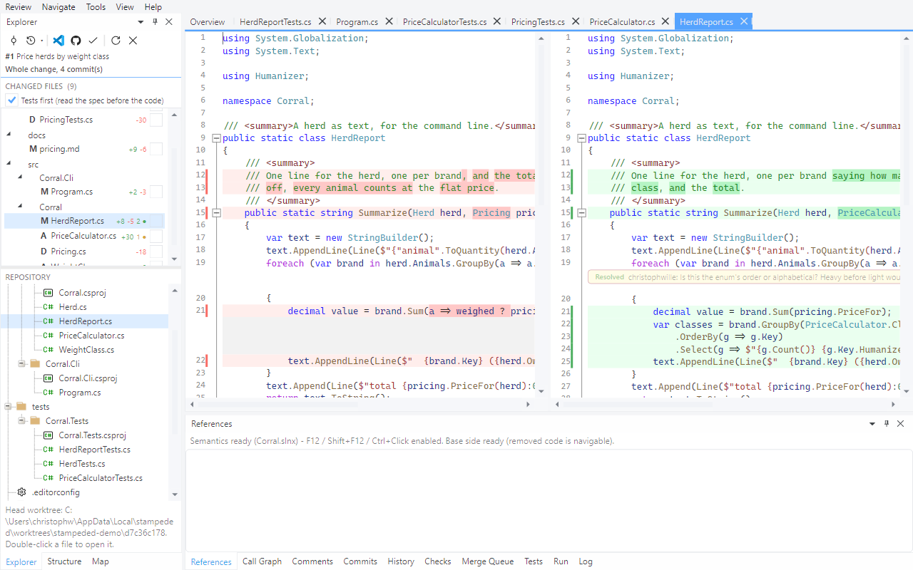

# Tour 1: Open a pull request and read it

A review is read file by file and hunk by hunk, with one hand on the keyboard. This tour walks
pull request #1 of the demo repository from the start page to the last file.

## 1. The start page

**Review > Open from URL...**, `christophwille/stampeded-demo`.

Three columns: the repositories you opened recently, the open pull requests with their CI
state and size, and your local branches with the pull request each belongs to and whether it
matches the remote. Typing into a list filters it.

## 2. The overview

Double-click **#1 Price herds by weight class**.

The overview is the review's home tab: a reading-time estimate, CI, who reviewed, the linked
issue, the rendered description. The Explorer on the left lists the changed files in reading
order - tests first, because the tests say what the change is meant to do. The lower half is
the whole repository at the pull request's head, not just the files that changed.

Nothing was checked out in your clone. The head lives in a detached worktree under the tool's
cache; your working tree and index are not touched.

## 3. The first file

Press `]`.

`]` and `[` step through the files. The diff carries both line numbers, marks what changed
inside a line, and is coloured and foldable like source in an editor - because to the tool it
is source, as tour 2 shows.

## 4. Hunks, and ticking a file off

`n` and `p` jump between hunks. `v` marks the file viewed and opens the next one; so does `n`
when there is no hunk left.

A whole review can be read with `n` and `v` alone. `o` goes to the overview and back to the
file you left.

## 5. What is not shown

Unchanged runs collapse into a bar that says how many lines it hides; click it to reveal them,
all at once or twenty at a time. A thread that has been resolved takes one line until you
ask for it. The strip at the right edge is the whole file: red and green where it changed,
amber where somebody commented.

## 6. Side by side

**View > Side-by-Side Layout**.

The choice is remembered. Either way a file is one tab.

## 7. Stop, and come back

Close the window in the middle of the review and open the pull request again: the files you
ticked are still ticked. That state is local, keyed by repository and pull request - and it
is what tour 5 builds on when the author pushes again.

Two files of this pull request show as one added and one deleted, although the author renamed
`Pricing.cs` to `PriceCalculator.cs`: across the whole change too little of the file is left
for git to call it a rename. [Tour 3](03-commit-by-commit.md) reads the same change one commit
at a time, where it is one.

Next: [Navigate the code in the diff](02-navigate-the-code.md)
