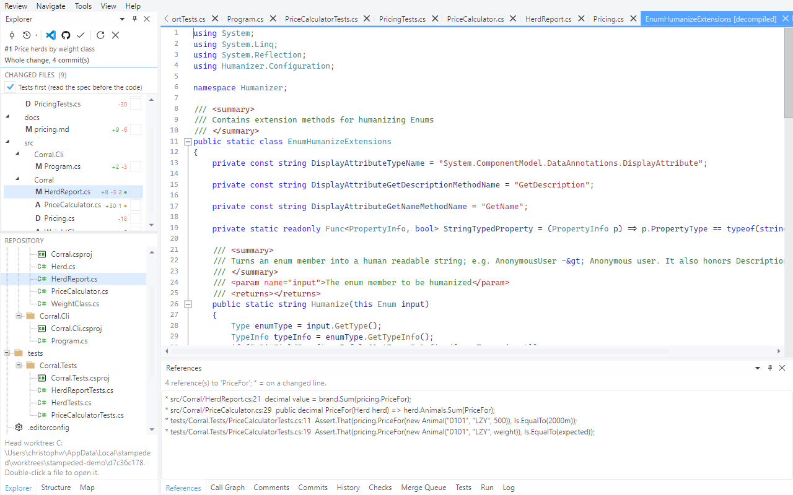
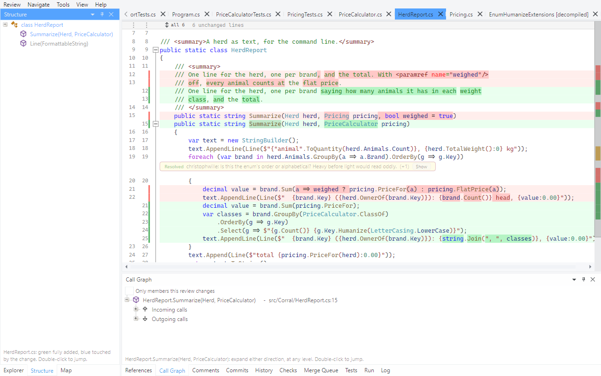

# Tour 2: Navigate the code in the diff

A web diff is text. Here both sides of the diff are compiled: Roslyn loads the solution at the
pull request's head, and a second view of it as it was at the merge base. Everything an IDE
answers about a symbol, the diff answers - on added lines, on context lines and on removed
ones.

Open pull request #1 of the demo repository and go to `src/Corral/HerdReport.cs`. The
References pane says when the solution has loaded; for the demo that takes a few seconds.

## 1. Hover

Rest the pointer on `ClassOf`.

Signature, documentation and null state, as in the IDE.

## 2. Go to definition

Put the caret on `ClassOf` and press `F12` (or Ctrl+click).

The target opens as its diff when the file is part of the change, as plain source when it is
not. `Alt+Left` goes back to where you came from, `Alt+Right` forward again.

## 3. Find references

`Shift+F12` on `PriceFor`.

A `*` marks the references that sit on a line this pull request changes - the call sites the
author touched, apart from the ones that were left alone. Double-click one to go there.

## 4. Removed code is still code

In `HerdReport.cs` a removed line calls `pricing.FlatPrice(a)`, a method this pull request
deletes. Put the caret on it and press `F12`.

It lands in `Pricing.cs` as it was before the change - a file that no longer exists at the
head. Hover and find references work there too, so "what did this do, and who else called
it?" is answered without leaving the review.

## 5. Into a package

`F12` on `Humanize`, which comes from the Humanizer NuGet package.

There is no source for it in the repository, so the type is decompiled and opened read-only.

## 6. Who calls this, and what does it call

Caret on `Summarize`, then **Navigate > Call Graph from Caret**.

Both directions expand level by level. **Only members this review changes** cuts the graph
down to the part of it the pull request is about.

## 7. The shape of the change

Two panes sit behind the Explorer. **Structure** is the outline of the file in front, with
the members the change touches tinted:

**Map** is every changed member of the pull request - green added, blue modified, red removed -
grouped by file. It is the quickest way to see that a change removed one method, added an
enum and rewrote one function, before reading a line of it:

Next: [Read it commit by commit](03-commit-by-commit.md)
