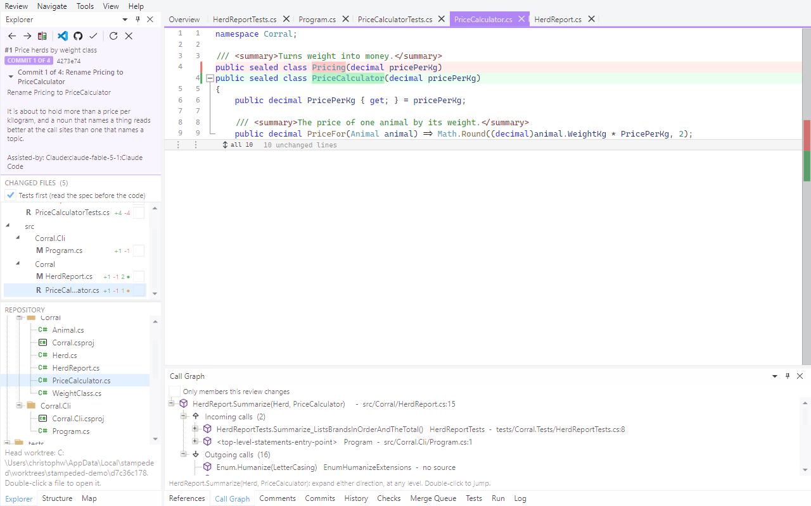
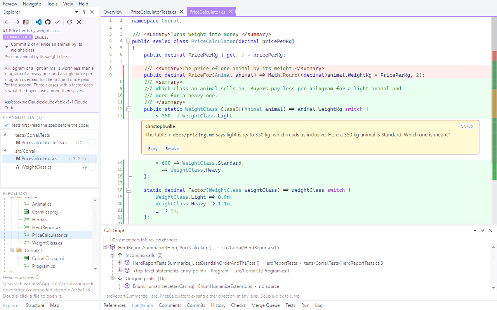
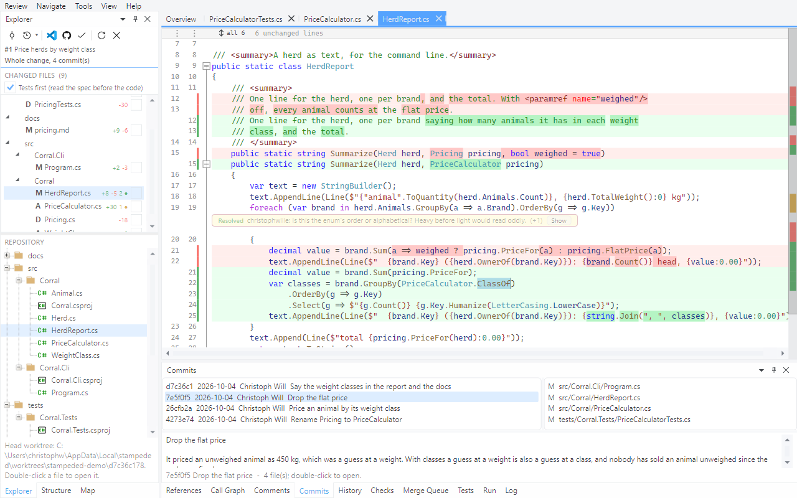
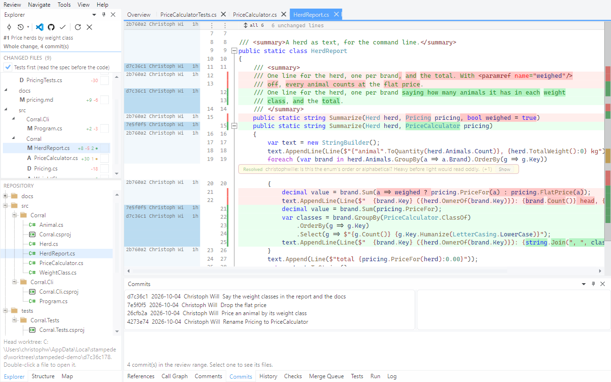
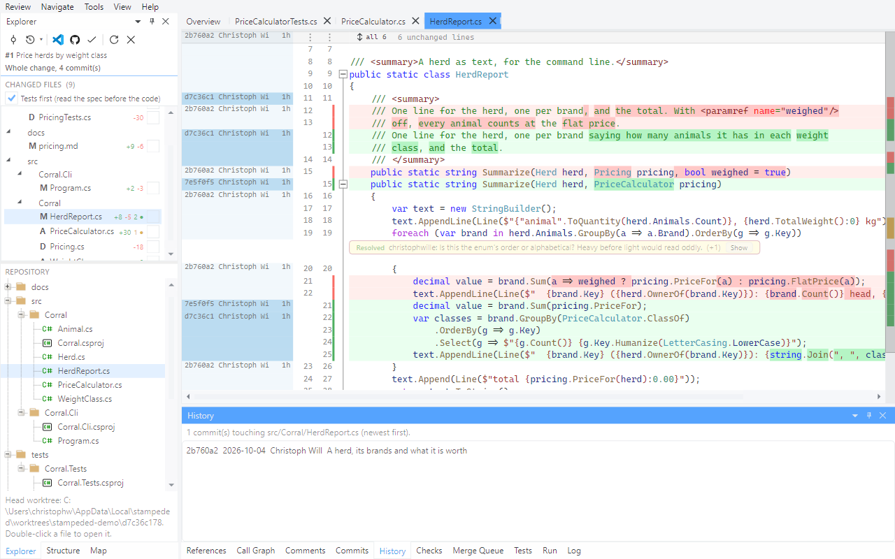

# Tour 3: Read it commit by commit

An author who took the trouble to split a change into commits has written you a reading
order. Pull request #1 of the demo repository is four commits, and its description says what
each one is for.

## 1. Enter the commit scope

**Review > Commit by Commit**, or the first button of the Explorer's toolbar.

The window turns purple so that you cannot mistake one commit for the whole change. The
Explorer shows the commit's message and only the files that commit touched; the overview
recomputes for it.

## 2. A rename that is a rename

Open `PriceCalculator.cs`.

In the whole change this file read as newly added (tour 1). In the commit that renamed it, it
is `R` and one line.

## 3. Step through the series

`Ctrl+]` is the next commit, `Ctrl+[` the previous one.

Viewed flags are kept per commit, so `v` works here as it does in the whole change. Comments
are the pull request's: the thread on line 13 shows in the commit that wrote that line.

**Review > Whole Change** leaves the scope. Approving while part of the series is unread is
refused, with that reason.

## 4. The commits, as a list

Back in the whole change, open the **Commits** pane.

Select a commit for its files and full message; double-click a file for what that one commit
did to it, without changing scope.

## 5. Blame

Press `b`.

Both sides are blamed: a removed line names the commit that wrote it, an added line the
commit of this pull request that added it. The margin is tinted by age, so the lines this
pull request wrote stand apart from the ones it inherited.

## 6. Where the file has been

The **History** pane follows the file in front.

It lists what touched the file on the branch your clone has checked out - where it was before
this change. Double-click a commit for its diff. **Navigate > History of Selection** searches
the same history for the commits that added or removed the text you selected.

Next: [Comment and submit](04-comment-and-submit.md)
