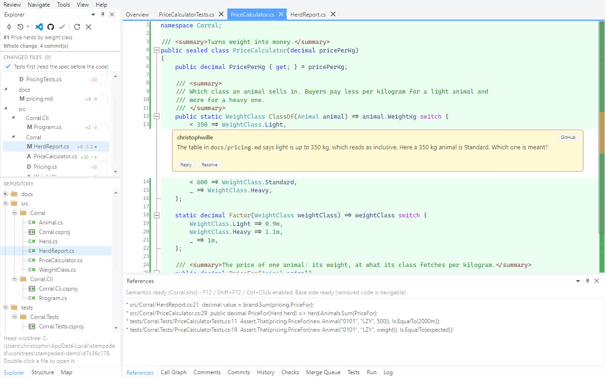
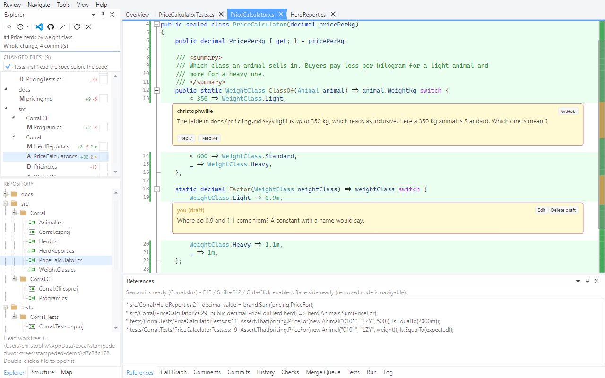
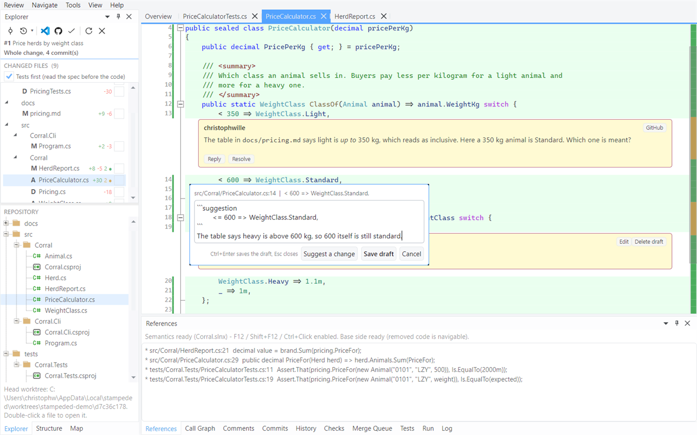

# Tour 4: Comment and submit

Comments are written where the code is and stay local until you submit. Nothing reaches the
pull request one remark at a time.

Open pull request #1 of the demo repository and go to `src/Corral/PriceCalculator.cs`.

## 1. What has been said

Threads from the host sit in the diff under the line they belong to, with Reply and Resolve
on them. The Explorer counts them per file: amber while something is open, green once
everything is settled.

## 2. Comment at the caret

Put the caret on a line and press `c`.

`Ctrl+Enter` saves, `Esc` closes. The editor does not go away when you click into the code
behind it once it holds text.

## 3. A draft

The draft shows where it will be posted and survives closing the app. Edit and delete are on
it.

## 4. Suggest a change

`c` on another line, then **Suggest a change**: the editor is prefilled with a suggestion
block holding the line, for you to rewrite.

On GitHub the author can commit a suggestion with one button. On Azure DevOps, which has no
such thing, it posts as a code block.

## 5. Reply

**Reply** on the posted thread.

A reply is a draft too.

## 6. Everything at once

The **Comments** pane lists drafts and posted comments of the whole review; double-click to
go to one.

**Review > Approve / Request Changes...** opens the review page: every comment quoted with
the code around it, as the author will meet it.

Read your own review once before it goes out. This is the place for the summary, too.

## 7. Submit

**Comment** posts the three drafts as one review. **Approve** and **Request Changes** are
greyed out in the picture because it was taken by the pull request's author, and GitHub takes
neither verdict from the author. On somebody else's pull request they are live.

A draft on a line the host would reject - a line outside the diff, a generated file - is kept
local rather than failing the whole review, and the result line says how many were.

Next: [Come back after a force push](05-after-a-force-push.md)
