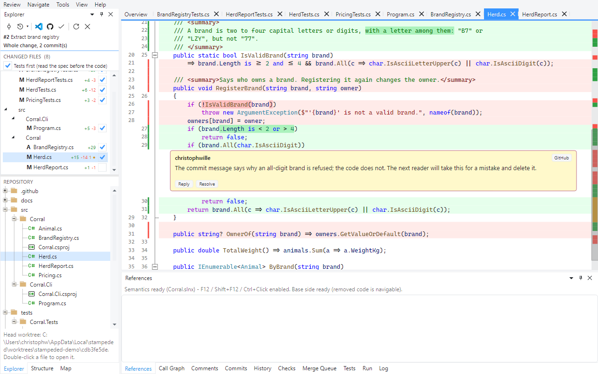
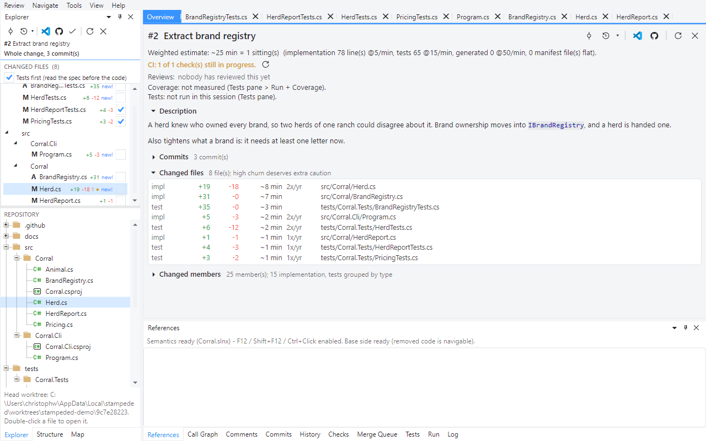
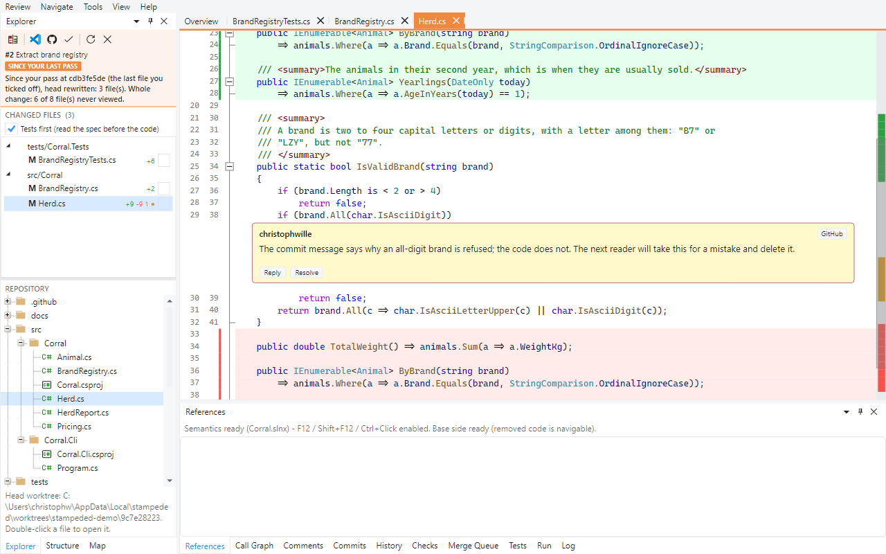

# Tour 5: Come back after a force push

You read a pull request, the author rebases onto a newer `main`, amends a commit and
force-pushes. On the web the review starts over: the commits you read are gone, and "changes
since your last review" is either unavailable or full of other people's work that came in
with the rebase.

This tour needs a push, so it cannot be followed in the shared demo repository. Fork it and
run its `stage.ps1` to play it yourself.

## 1. The first reading

Pull request #2, every file ticked off with `v`. One thread sits on line 29 of `Herd.cs`.

## 2. The push

The author rebases onto `main`, which gained a commit in between, moves `IsValidBrand` to the
end of its file, and adds a third commit. `stage.ps1 -Push2` does that.

Reload with `F5`, or just open the pull request again.

The two files that read the same as before are still ticked. The other six are unticked
again - you read them, but not as they are now - and `new!` on a file says it changed since
you did.

## 3. Since your last pass

**Review > Since Last Pass**.

Three files instead of eight, and in them only the author's own edits. What `main` brought in
through the rebase is not in this diff, although it is in the difference between the two
pushes.

That works because the comparison is not between the old head and the new one. The work you
read is replayed onto the new base as a tree, and the new head is diffed against that. The
window is orange for as long as you are in this scope.

**Review > Last Pass Was** chooses what counts as your last pass: the last file you ticked
off (the default - opening a review is not reading it), your last submitted review, or the
last time you opened it.

## 4. The comment went with its line

The thread written against line 29 of a commit that is no longer on the branch sits on line
38, on the same statement, in the method that moved. Where the host no longer says which line
a comment is on, it is found again by its content, and failing that by the member it was
written in.

Next: [CI, tests and coverage](06-ci-tests-coverage.md)
