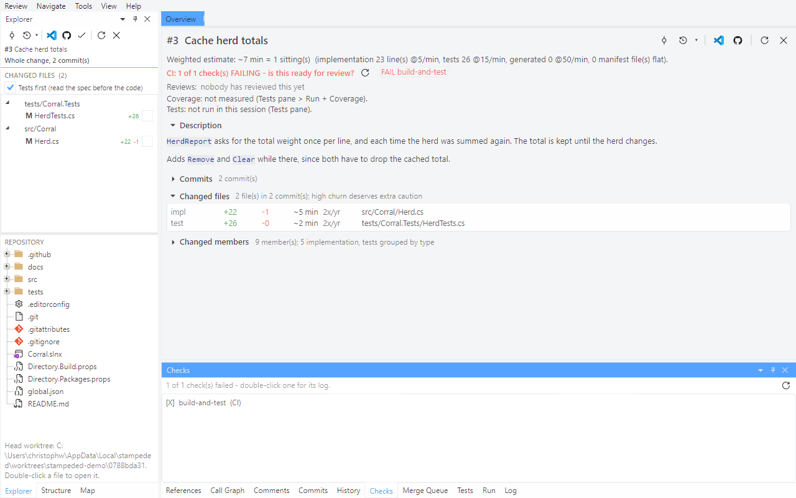
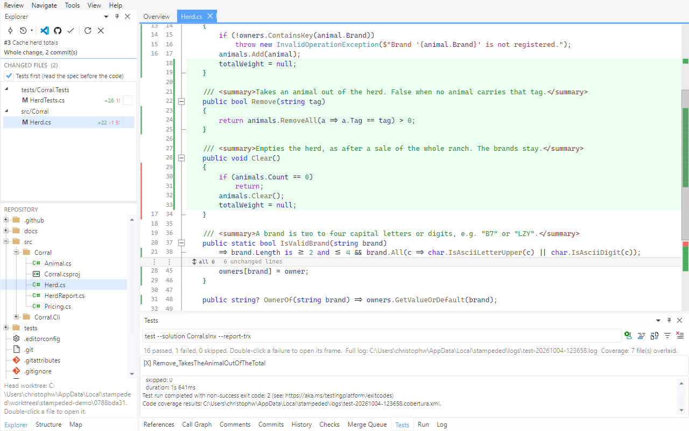
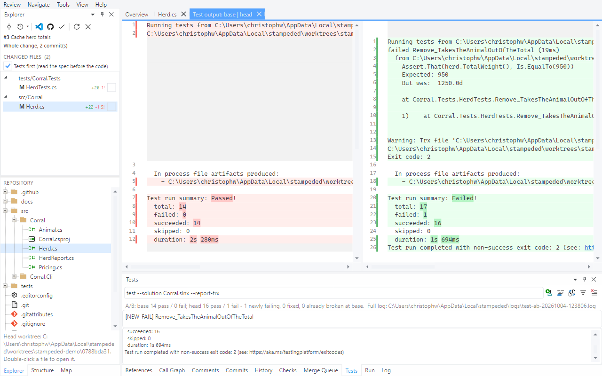

# Tour 6: CI, tests and coverage

A red check says that something failed. This tour gets from there to the line that is wrong,
and to the lines no test ran at all - in the pull request's head, without checking it out.

Open pull request #3 of the demo repository. One of its tests fails on purpose.

## 1. Checks

The overview asks the question a failing pull request raises - is this ready for review? -
and the **Checks** pane lists the runs, failures first. Double-click a failed run for the log
of the step that failed, not the whole job's.

## 2. Run the tests yourself

**Tools > Run Tests**.

The tests run in the head worktree, so the result is the pull request's and your own checkout
is not involved. Failures are listed above the live output; double-click one to open the frame
it failed in. The command line is editable, for a filter or another solution.

## 3. Coverage

**Tools > Run + Coverage**, then open `src/Corral/Herd.cs`.

The strip beside the line numbers is green where a test ran the line and red where none did.
`u` jumps to the next *added* line that no test covered, and the Explorer says how many each
file has (`5!`). Here `Clear()` was added and never called by a test.

This wraps the run in `dotnet-coverage`, which has to be installed once:
`dotnet tool install -g dotnet-coverage`.

## 4. Was it broken before?

**Tools > Run A/B (base vs head)**.

The tests run at the merge base and at the head, and the result says what the change did: one
test newly failing, none fixed, none that was already broken. The two outputs open as a diff.
"It fails on main too" stops being something you take the author's word for.

**Tools > Impacted Test Filter** fills in a filter for the tests the change affects, for a
solution whose whole suite is too slow to run on every review.

Next: [Review a local branch](07-local-branches.md)
