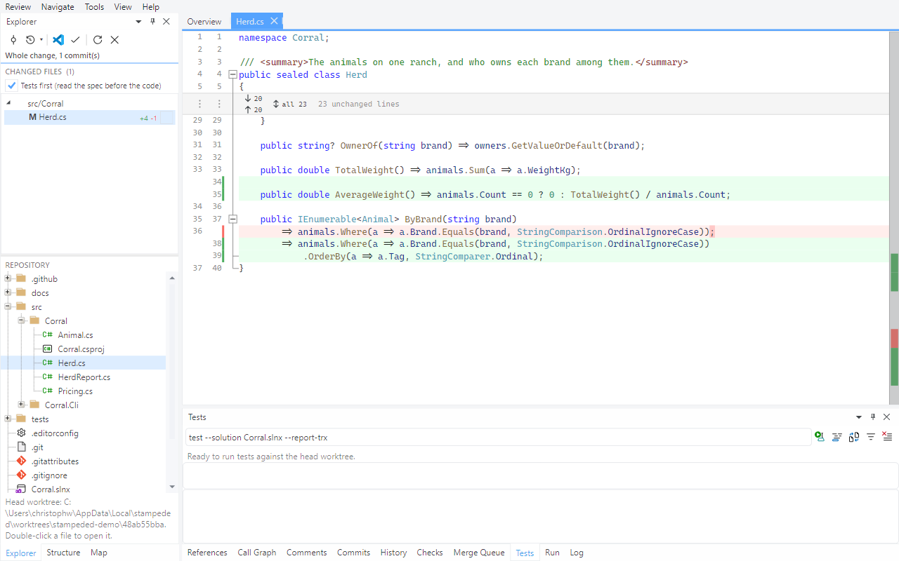
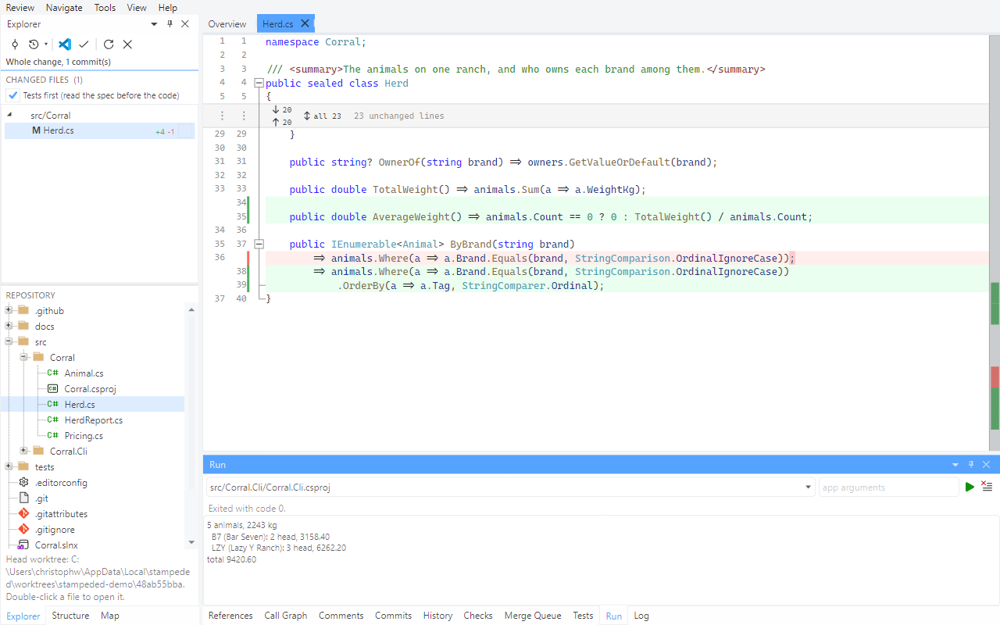

# Tour 7: Review a local branch

Everything in the earlier tours works without a pull request. The most useful review of all
is the one of your own branch, before anyone else sees it.

In a clone of the demo repository, `./stage.ps1 -Local` creates the branch this tour uses:
`local/dirty-work`, one commit on top of an older `main`, with an uncommitted edit.

## 1. Branches on the start page

**View > Start Page**.

Each branch says how many commits it has, which pull request it belongs to and how it stands
against the remote: `in sync`, or - as `feature/brand-registry` here, after the force push of
tour 5 - `2 ahead, 4 behind`. The context menu pulls a branch from the remote without
checking it out. A rebase or merge left unfinished shows as a banner here, with Resolve,
Continue, Skip and Abort on it.

## 2. Open the branch

Double-click `local/dirty-work`.

The review is the branch against its merge base with `main`. Because the branch is checked
out and the checkout is dirty, the head is the working tree: the overview says so, and the
commit list has an `uncommitted` row above the one commit.

## 3. Read what you are about to commit

`AverageWeight` is not committed yet; the `OrderBy` is. Both read, navigate and fold like any
other change - which makes this the place to catch what a reviewer would, before there is one.

## 4. Run it

**Tools > Run Application**.

The **Run** pane lists the executable projects of the review's worktree and runs the one you
pick, with arguments if it takes any.

Next: [Merge](08-merge.md)
