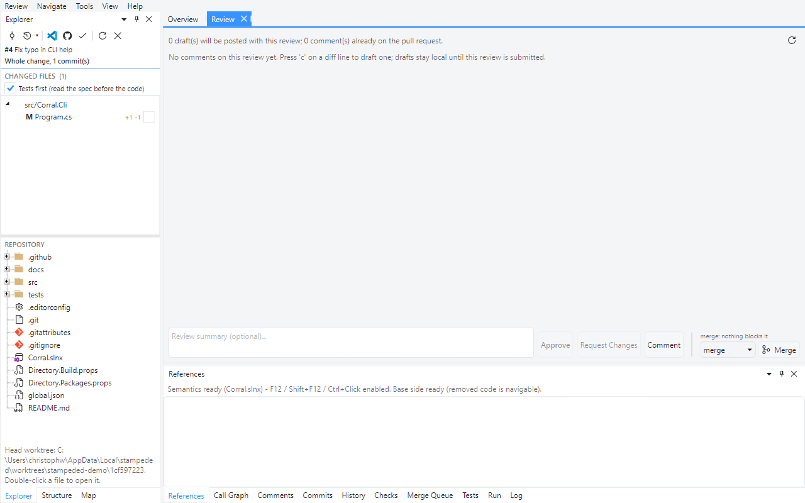
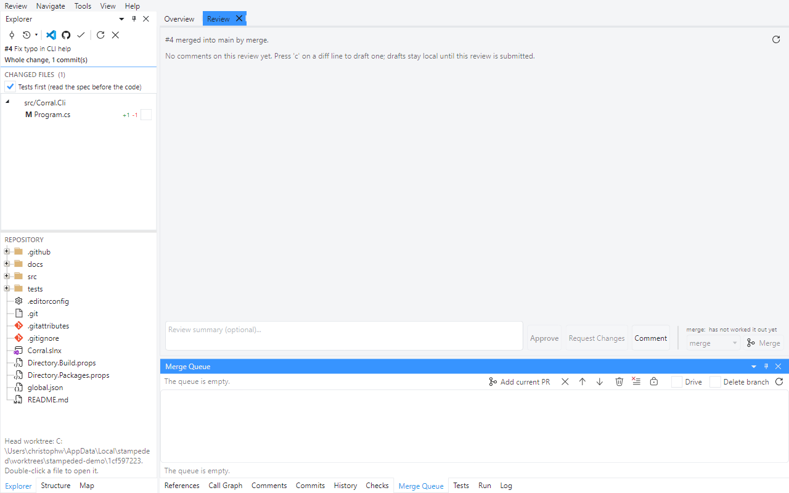

# Tour 8: Merge

The last step of a review is not a verdict, and it is kept apart from the three that are.

The demo repository has a one-line pull request for this, **Fix typo in CLI help**. It is #4
in the pictures; its number changes every time the demo is staged again. Please do not merge
it in the shared repository - fork it to follow this tour.

## 1. What blocks the merge

**Review > Merge Pull Request...** opens the review page, where the merge block sits beside
the verdicts.

The line above the button is the answer to "why can't I merge this?": failing checks, a
missing approval, a branch behind its target, a draft - at most two reasons, the rest in the
tooltip. GitHub works this out when first asked, so a pull request nobody has looked at yet
says that it has not worked it out; the refresh button at the top right asks again.

The dropdown lists only the merge methods the repository allows, and remembers your choice.

## 2. Merge

Merging ends the pull request for everyone, so it asks once - and says the method, both
branches and whether the head branch goes with it.

## 3. The merge queue

When several approved pull requests wait for the same target, each merge makes the next one
stale. The **Merge Queue** pane - at the bottom of the picture above - holds a queue shared by
everyone who reviews the repository with this tool. It lives in a ref on the remote, so there
is no server and nothing to set up. Add the pull request in front, with the merge method you
want for it, and switch **Drive** on: it merges the first entry that can be merged and passes
over the ones that cannot, saying why. An entry that was pushed to after it was queued has to
be queued again. Entries that left the queue stay listed with the reason.

## Offline

What only the host knows about a pull request - description, comments, checks - is cached
when you read it. Open the same pull request without a network and it reads from that cache
and the commits already in your clone. It says that it is offline, and refuses to submit or
merge.

Back to the [index](README.md).
